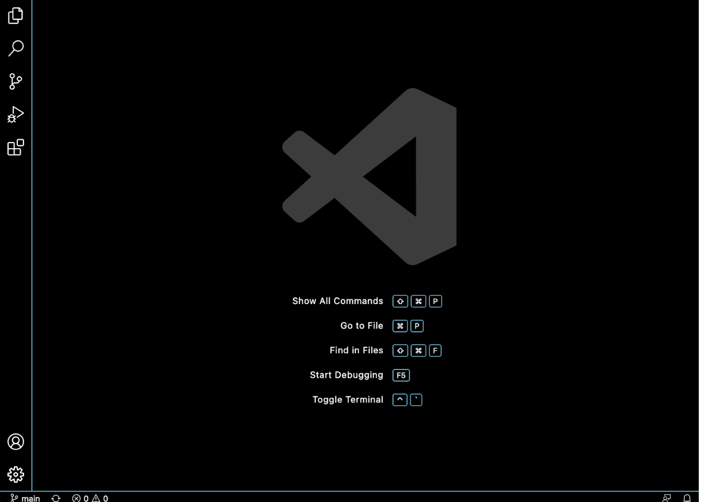
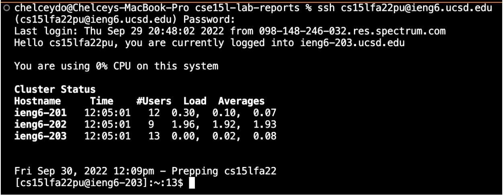
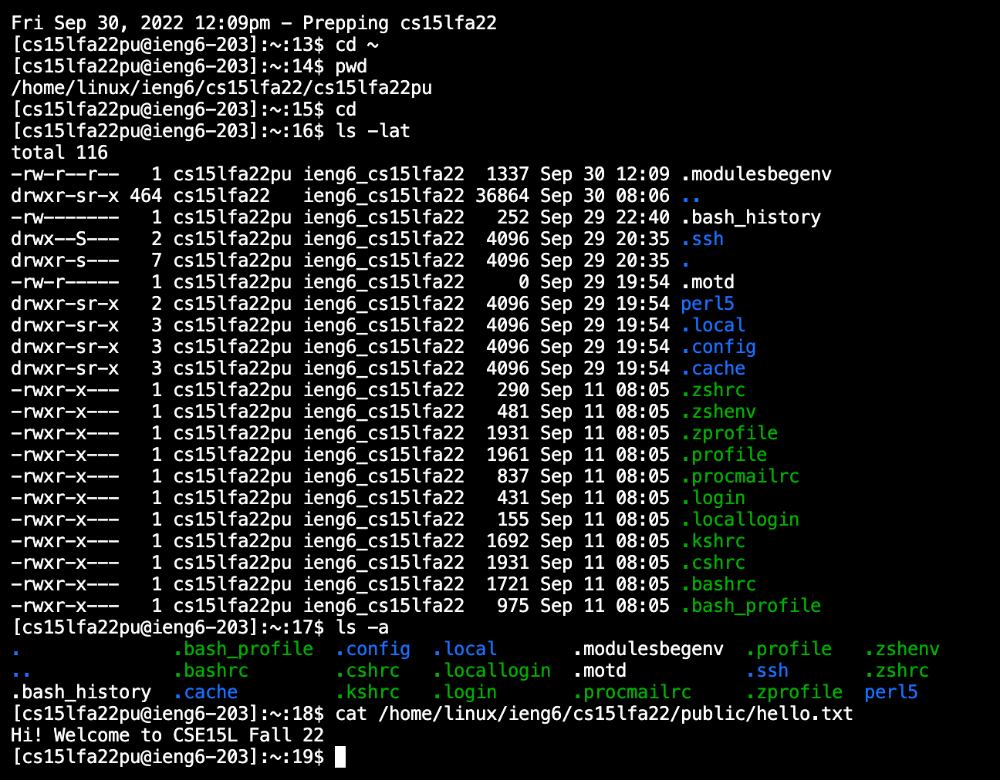
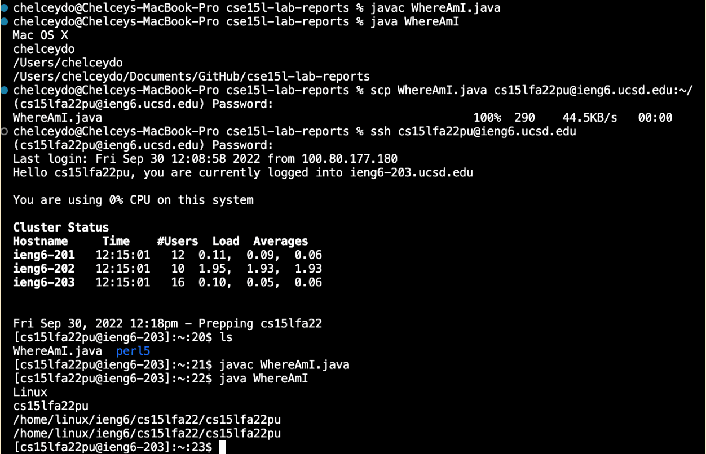
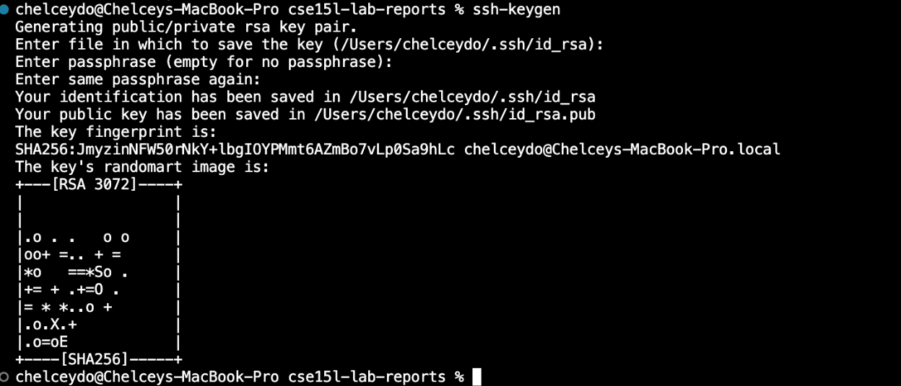
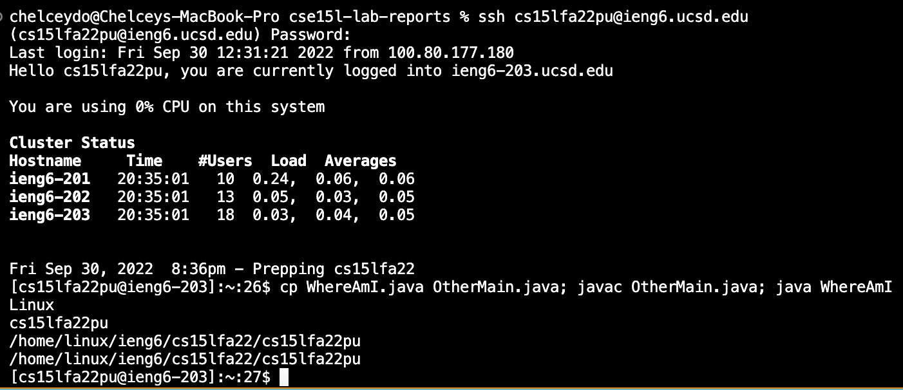

*Week 1 Lab Report*
# <span style="color:blue">**Remote Access**</span>
## **A Tutorial on how to log into a course-specific account on ieng6**

***

## <mark >**Step 1: Installing VScode**</mark> 

### *Disclaimer: I am using a Macbook Pro (Intel), so it may be different for you~* ###

1. Download VScode from this link:
[Click here to go download Vscode](https://code.visualstudio.com/download)
2. Double-click on the zip to open VScode
3. Drag VScode to the Applications folder
4. To keep VScode in the Dock, right click the app and go to options, and click Keep in dock
5. Press the app to launch it

> *I didn't do these steps exactly, because I already installed VScode on my laptop over the summer break.* 

***
## <mark>**Step 2: Remotely Connecting**</mark>


1. Open a terminal by using the Terminal 
2. Put in the command that looks like this, but with the <mark >pu</mark> replaced by the letters in your course-specific account

```ssh cs15lfa22puzz@ieng6.ucsd.edu```

3. If this is your first time connecting, it will give you a prompt asking whether if you want to cintinue connecting (yes/no). Type: yes (*press enter*)
4. Give your password

*The password you set up for your course-specific account*

> Your terminal should now be conncted to a computer in the CSE basement!! 😃

***
## <mark>**Step 3: Trying Some Commands**</mark>

There are many commands to try. I think a great place to look up some commands for terminal is on this page that I will link here. 
[Basic Linux Commands](https://maker.pro/linux/tutorial/basic-linux-commands-for-beginners)

<sup>1</sup>All credits go to Alok Naushad (Linux Programmer & Android Developer) 

The commands I used during lab were:
`cd` 
: stands for change directory

`~`
: shows the current directory you are in

`ls`
: list files or directories

`lat`
: shows you all the different account in the same network

After testing some commands, you need to type: `exit`
***
## <mark>**Step 4: Moving Files with scp**</mark>


1. After you exit, you are now back in your own personal computer. 
2. Create a new file and call it: 
> WhereAmI.java

In it, copy & paste this in:

`
class WhereAmI {
  public static void main(String[] args) {
    System.out.println(System.getProperty("os.name"));
    System.out.println(System.getProperty("user.name"));
    System.out.println(System.getProperty("user.home"));
    System.out.println(System.getProperty("user.dir"));
  }
}
`

3. Compile and run the program with these commands:

`javac WhereAmI.java`

`java WhereAmI`

*If java is not installed on your pc, run this command:

4. To copy a file from your pc to a remote computer. 

`scp WhereAmI.java cs15lfa22pu@ieng6.ucsd.edu:~/
`

5. It will ask you for your password, just like how it did with ssh 


***
## <mark>**Step 5: Setting an SSH Key** </mark>


> Here is where I ran into an error. 

1. Exit out of the login, so you are on your pc
2. Type: `ssh-keygen`

<span style="color:red"> *The ssh-keygen portion is where I ran into an issue. Basically, I can use the passcode I set up fine to login, but when it prompted me again for it, I gave the passcode again and for some odd reason it just didn't work at all. I even tried copying the passcode, to ensure that I was inputting it in correctly, and it denied me access.*</span>
***
## <mark>**Step 6: Optimizing Remote Running**</mark>


##<mark>**Progress Update:** </mark> 
## I went to OH and was able to get it running. 
*updated photo*


<span style="color:red"> *Since the error was in step 5, I was not able to optimize remote programming. Therefore I do not have a screenshot for this section. Although, I was not able to optimize remote running, I was still able to effectively run a bunch of commands on one line.*</span> 😟

***
💕<span style="color:pink"> Since I was not able to attend office hours due to my class schedule on 09/30/2022 Friday. I would need to head to an office hour next week to find a way to fix the issue. I will update the blog when I am able to. Thank you for reading!!</span>

***
## <mark>** Updated Version**</mark>


