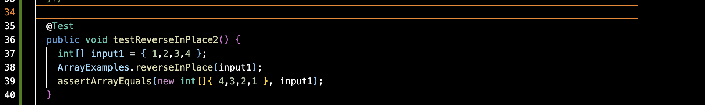
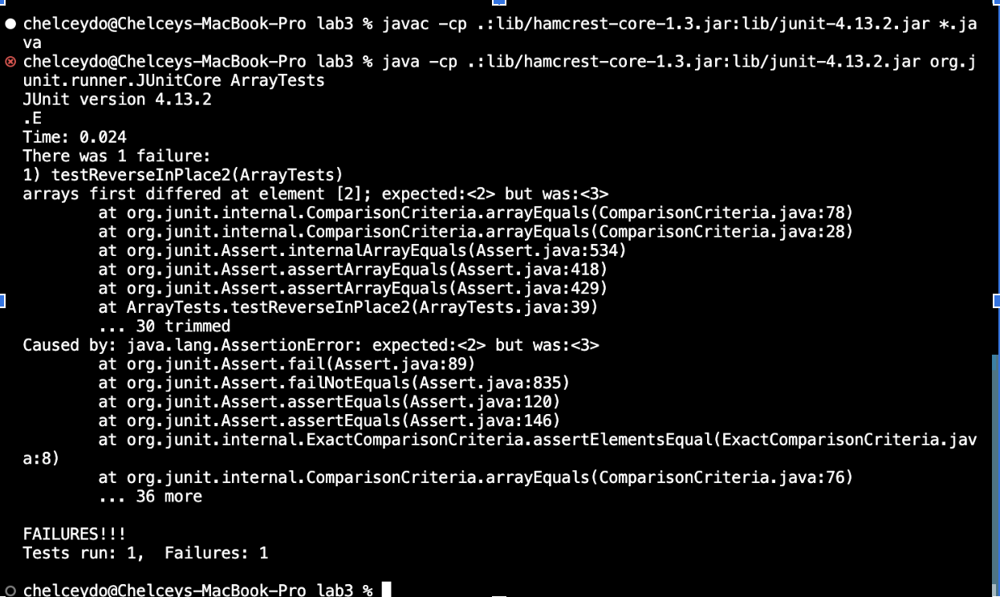
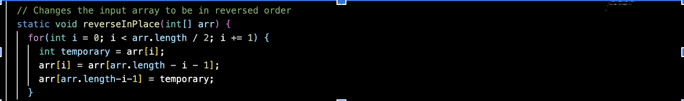

*Week 3 Lab Report*
# **Remote Access**
## **A Tutorial on how to log into a course-specific account on ieng6**

***

## <mark >**Part 1**</mark> 
## **To-Do List:**
- [] Using a code block in Markdown show the code for my Simplest Search Engine

`Simplest Search Engine code goes here`

- [] Three screenshots of using Simplest Search Engine

1. Simplest Search Engine (initial)

###  Which methods in your code are called? 
###  my Answer 

###  What the values of the relevant arguments to those methods are, and the values of any relevant fields of the class? 
###  my Answer 

###  If those values change, how they change by the time the request is done processing? 
###  my Answer 

2. Simplest Search Engine (add)

###  Which methods in your code are called? 
###  my Answer 

###  What the values of the relevant arguments to those methods are, and the values of any relevant fields of the class? 
###  my Answer 

###  If those values change, how they change by the time the request is done processing? 
###  my Answer 

3. Simplest Search Engine (query)

###  Which methods in your code are called? 
###  my Answer 

###  What the values of the relevant arguments to those methods are, and the values of any relevant fields of the class? 
###  my Answer 

###  If those values change, how they change by the time the request is done processing? 
###  my Answer 

### *Disclaimer: I am still working on Lab 2, I got stuck so, I will try to attend OH for help next week~* ###

***

## <mark >**Part 2**</mark> 
## **Stuff:**
1. The Failure-inducing input (the code of the test)

2. The Symptom (the failing test output)

3. The bug (code fix needed) :bug:

###  *Explain the connection between the symptom and the bug:* 
###  I think the connection between the symptom and the bug is that the symptom is what goes on in the output terminal, whereas the bug is the issue (problem) 

###  *Why does the bug cause that particular symptom for that particular input?* 
###  The bug causes that particular symptom for that particular input because it is the flaw in the program. Since its a flaw, it affects the output in the terminal which is the symptom. 

### *Disclaimer: I am using a Macbook Pro (Intel), so it may be different for you~* ###