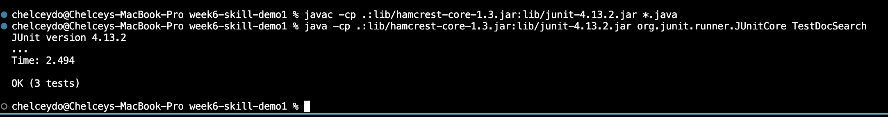

#  **Lab Report 4 Week 7**
##  **Chelcey Do**
---

#  **Lab Goals:**
> Focuses on VIM (material from Week 6 Lab).

#  **Pre-Task List:**
- [x] Fork the given [Repository](https://github.com/ucsd-cse15l-f22/list-examples-grader)
- [x] Given a list of repositories to test the grader

#  **Part 1:Task List:**

## Pick one of the tasks from the week 6 lab that your group completed in Vim in the second set of tasks.
---
###  Changing the name of the `start` parameter and its uses to `bases`
   
## Give the shortest sequence of vim commands (less than 30 total keys pressed)
       1. Write out the sequence of keys to press using code formatting (with backticks `). 
       2. Use `<>` to indicate special keys (`<Backspace>` or `<Enter>` or `<Esc>`) and just the keys themselves for other keys pressed. 
       3. Take a screenshot or describe which commands/keypresses got to that step, for each command where you move the cursor or change the text. 
---
###   I would have to say that I don’t think my VIM commands are accurate. I accidentally forgot to keep complete track of how many j's ,l's ,esc's, and :wq's I have done.  I would say that this is just a rough estimate and that there is altogether at least 30 key presses at the most.

`j` (12 times)
`l` (2 times)
`x` (5 times)
`i` (1 time)
`base` (4 for each letter) 
`j` (13 times)
`l` (14 times)
`x` (5 times)
`l` (1 time)
`base` (4 for each letter)
`<esc>` (1 time)
`x` (1 time)
`j` (4 times)
`<:wq>` (1 time) 
   

--- 
 
      
#  **Part 2:Task List:**
- [x] Start in Visual Studio Code and make the edit there 
- [x] `scp` the file to the remote server and run it there to confirm it works (you can just run `bash test.sh` on the remote to test it out)
- [x] Start already logged into a `ssh` session
- [x] Make the edit for the task you chose in Vim, exit Vim and run `bash test.sh`
- [x] Report how long it took you to make the edit in seconds in both styles, and any difficulties or details that came up in doing so. 

## TIME
| VISUAL STUDIO CODE | VIM |
| ----------- | ----------- |
| A long time (Several Days) | 1 hour |

## Which of these two styles would you prefer using if you had to work on a program that you were running remotely, and why?
>  Out of these two styles I would prefer using VIM if I had to work on a program that I was running remotely. The reason is that I felt like there was less steps to do in VIM, and I didn’t have to worry about if whether SSH will decide to prompt me for a password while logging in.

## What about the project or task might factor into your decision one way or another (If nothing would affect your decision, say so and why!?) 
>  After doing the project or task I felt like after trying out both styles, I just felt like the VIM style was less work. The only work was figuring out how to even start.

### [Back to Contents:](https://chelcey.github.io/cse11-lab-reports/)****
